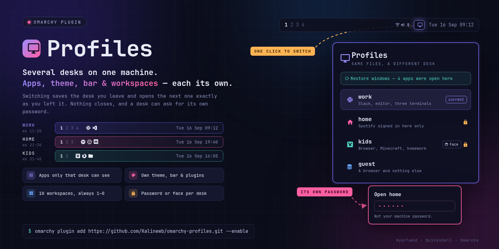

# Profiles

Several desks on one machine. Each one keeps its own apps, theme, bar,
plugins and workspaces — and hands the machine back exactly as you left it.



## What it is for

**The family PC.** The kid's desk has the browser, Minecraft and the homework
folder. Not "your things are in a folder they were told not to open" — your
applications are not in their launcher, not in their search, not there. Your
own desk asks for a password.

**Work and not-work.** Slack, the editor and three terminals live in `work`.
At six o'clock you switch to `home` and they are gone from the launcher, which
is the part that actually stops you opening them. Monday morning they are
still open, on the same workspaces, where you left them.

**Lending the laptop.** A `guest` desk with a browser and nothing else, made
in about four seconds. Hand it over without narrating what not to click.

**Getting something done.** A desk where Discord is not installed, as far as
anything on screen can tell. The apps you took out are the feature.

## A desk, not a preset

Switching does not apply a template — it **captures the desk you are leaving
first**. Change the theme in `work`, switch to `home`, switch back: `work` is
how you left it, down to the wallpaper and which plugins were running.

Nothing closes when you switch. And after a restart, a desk can offer to reopen
what it had open.

## Install

```bash
omarchy plugin add https://github.com/Kalinewb/omarchy-profiles.git --enable
```

Then click the Profiles icon on the bar. It opens on **Setup**, which is a list
of everything that has to be true before profiles work — adopting this machine
as your first desk, the workspace keys, the bar's workspace indicator. Each row
says what it is for, and most carry a **Fix** that does it — the ones that do not
are the ones about your own configuration, which this plugin does not edit.
Nothing here asks for a password or installs anything outside your home
directory. Adopting reads your desktop as it already is and changes nothing.

## The panel, view by view

Everything is in the panel. There is a command-line engine underneath it — the
keybindings and the panel both call it — but it is not a supported interface and
its verbs move with the plugin.

### Switch

The list of desks, and a padlock beside any that asks for something. Click one:
the outgoing desk is captured, the incoming one is applied, and the shell
restarts, which is why the panel closes and the bar blinks.

When a desk starts empty and remembers windows from last time, **Restore
windows — 4 apps were open here** is at the top. The button is the guarantee;
the notification that offers the same thing after a reboot is the convenience.

### Manage

Every profile with its actions: what it may use, its name and icon, its
configuration, a password, hiding it from the switcher, removing it. **Capture
now** saves the desk as it is this second — switching already does this for you.

**What is open** lists every profile's windows, with the memory each one is
holding, and can ask a whole desk to close.

**New profile** is either a copy of your master — same apps, same plugins,
already signed in where the master is — or clean, which starts with nothing and
makes fresh state for every plugin.

At the foot: **Uninstall Profiles from this machine**.

### A profile's apps and plugins

The gear on a profile's row. Two lists: which plugins run in that desk, and
which applications exist in it. An application that is not allowed is not
hidden behind anything — it is not in the launcher, not in the menu, not in
search, for as long as that desk is the one you are in. The master sees
everything by definition, so it has no list.

### Configuration

The wrench. The top is what that desk *is* — theme, wallpaper, bar, how many
plugins and apps, its block of workspaces, do-not-disturb, idle timers — and
whether it reopens apps when you enter it: **Off**, **Ask** or **Always**.

Everything below that is machine-wide, because it is one decision for the whole
machine rather than a setting per desk:

- **Plugin data.** Whether a plugin's own state follows the profile. On: each
  desk has its own Spotify account and its own dock layout. Off: it is the same
  in every desk.
- **Hyprland.** Per-profile `looknfeel.lua`, `bindings.lua` and `input.lua`.
  Offered only where Hyprland has been measured to re-read a swapped file, and
  a copy that breaks the config is rolled back on the spot, with a line saying
  where the broken one was kept.
- **A workspace outside every desk**, for music, a download, a long build.

## Workspaces

Hyprland has no app grouping, so workspaces are the layer available: five
fullscreen apps is five workspaces. Each desk owns a block of ten — master
1–10, the next 11–20 — while `SUPER+1..0` always means "this desk's first
through tenth", and the bar always reads 1–0. Setup writes the file that does
that and adds one line to `hyprland.lua`; it never edits bindings you wrote
yourself, and says so if it finds some that fight it.

## What the password does, and what it does not

It gates **entering** a profile from the desktop. It stops the person sitting at
the keyboard, which is the threat it was built for: a family laptop, a lent
machine, a desk left unattended for a minute.

**Changing or removing it needs that password, or yours.** The password is stored
hashed in your own state folder, `~/.local/state/omarchy-profiles/secrets`. Changing
it asks for the current one; resetting one nobody remembers, or overriding a
profile's password to remove or rename it, asks for **your login password** —
checked by `unix_chkpwd`, the same Linux-PAM helper screen lockers use, which only
answers yes or no. The same goes for a face bound to a profile: binding or changing
one asks for the profile's password, or yours. A reset also takes off any face
bound with the old password.

**Giving a profile its first password asks nobody.** A desk without one opens for
anyone at the keyboard, so putting one on takes nothing away — and the person
using a desk can protect it without fetching you.

**It is not a security boundary**, and no setting here makes it one:

- Every profile runs as the same Linux user, so another profile's files can be
  **read** without entering it.
- The check is made by this plugin, from files in your home directory. Someone
  comfortable editing those files can take a password off, or switch without
  being asked.

If you need contents another person genuinely cannot read, you need encryption
and a separate login, and this is not that.

A bound face is a **shortcut**, not a second lock. It saves typing the password;
the password always works.

**Nothing runs as root.** Profiles installs nothing outside your home directory and
never asks for administrator rights. Versions before 1.3 kept passwords in a
root-owned store; if Setup shows **Old password store**, it lists the files to
remove as an administrator, and each protected profile needs its password set again
(until then it opens with your login password).

## Removing it

**Use this plugin's own screen, not Omarchy's Plugin Manager.** Plugin Manager
takes the plugin off the bar properly — the folder, the bar entry, the
enablement — but it has no way to know about your profiles, their saved files,
the hidden applications, the per-profile browser data or the workspace keys, and
it will not touch any of that. Removed that way, all of it is left behind, and
`SUPER + 1..0` keeps calling a script that is gone. If you have already done
this: nothing is lost, run `bin/omarchy-profile purge --yes` from the backed-up
copy Plugin Manager made
(`~/.config/omarchy/plugins/.kalinewb.profiles.bak.<timestamp>`) to finish the
job properly.

The right way: Manage → **Uninstall Profiles from this machine**. One toggle,
**Keep a copy of my profiles** (off by default — turn it on to save everything
to `~/omarchy-profiles-export` before anything is removed), and one button,
**Uninstall everything**. That one click hands the machine back as your master
profile has it — and everything that is *not* master's is discarded, which is
what the "keep a copy" toggle is there for: windows on other desks move onto master's workspaces, every
isolated file becomes a real file again, every hidden application comes back,
the workspace keys and the widget go, the stored passwords go, and the plugin
uninstalls itself. It has to run from the master profile; from anywhere
else the button is **Switch to master first**.

From a checkout, the same thing without a panel:

```bash
bin/omarchy-profile purge --dry-run --json      # what would go
bin/omarchy-profile purge --export ~/backup     # copy it out first
bin/omarchy-profile purge --yes                 # do it
```

One thing it will not do for you: if you bind workspace keys by hand in your own
Hyprland config, that block calls this plugin and will stop working. It is
listed on the confirmation screen, and taking it out is yours — nothing here
edits your configuration.

## What it writes

Switching profiles is not a read-only act, so it is worth knowing where it
reaches:

| Path | What for |
|---|---|
| `~/.config/omarchy/profiles/` | one file per profile: its apps, plugins, theme, bar and workspace block |
| `~/.config/omarchy/shell.json` | rewritten on every switch — the bar and plugin list are part of a profile |
| `~/.local/share/applications/` | hiding an app from a profile means a `.desktop` entry of its own here, tagged as this plugin's. This is your launcher directory, so it is the widest reach the plugin has |
| `~/.local/state/omarchy-profiles/` | isolated per-profile files, sessions, password hashes, the switch log |
| `~/.local/share/omarchy-profiles/browser/` | per-profile browser data, when a profile names its own browser |
| `~/.config/hypr/profiles-keys.lua` | the workspace keybinds, plus one `require` line in `hyprland.lua` |

Uninstalling takes all of it back off (see Removing it, below). Nothing is
written outside your home directory, and nothing runs as root.

## Dependencies

`jq`, `hyprctl` and `openssl`, which Omarchy already has, and `unix_chkpwd` from
Linux-PAM for the login-password override. Each is checked for rather than
assumed: without `openssl` or `unix_chkpwd` the password controls are switched
off and say why, instead of failing at the prompt. [omarchy-face] is optional and the dependency is one way:
without it a profile can still have a password, and one bound to a face says so
rather than becoming unopenable.

[omarchy-face]: https://github.com/Kalinewb/omarchy-face

Licensed MIT, see `LICENSE`.

## Why a switch restarts the shell

Plugins hold their own configuration and state open, so a reload does not notice
a swapped dock file or a plugin that was off a moment ago. The restart is one
visible blip and is always right, which the alternative was not.
